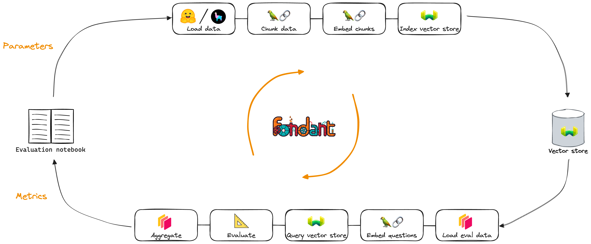

# Retrieval Augmented Generation (RAG) Tuning

<p align="center">
    <a href="https://github.com/ml6team/fondant">
        
    </a>
</p>
<p align="center">
</p>

## Introduction

This repository contains data pipelines and ready-to-use notebooks for tuning RAG systems both manually and automatically using parameter search.
To achieve this, it leverages [Fondant](https://github.com/ml6team/fondant), a free and open source framework for production-ready, easy and shareable data processing.

## Available notebooks

### A simple RAG indexing pipeline

A [**notebook**](./src/pipeline.ipynb) with a simple Fondant pipeline to index your data into a 
RAG system.

### Iterative tuning of a RAG indexing pipeline

A [**notebook**](./src/evaluation.ipynb) which iteratively runs a Fondant
[indexing pipeline](./src/pipeline_index.py) and [evaluation pipeline](./src/pipeline_eval.py) with 
different parameters for comparison. You can inspect the data between every step to make 
informed choices on which parameters to try.

### Auto-tuning of a RAG indexing pipeline

<p>
    A <a href="./src/parameter_search.ipynb"><b>notebook</b></a> which allows you to automatically search for the 
    optimal parameter settings using different methods
</p>
<br>
<p align="center">
    <a href="./src/parameter_search.ipynb">
         
    </a>
</p>

## Getting started

> ⚠️ **Prerequisites:**
>
> - A Python version between 3.8 and 3.10 installed on your system.
> - Docker and docker compose installed and configured on your system. More info [here](https://fondant.ai/en/latest/guides/installation/#docker-installation).
> - A GPU is recommended to run the model-based components of the pipeline.

### Cloning the repository

Clone this repository to your local machine using one of the following commands:

**HTTPS**
```shell
git clone https://github.com/ml6team/fondant-usecase-rag.git
```

**SSH**
```shell
git clone git@github.com:ml6team/fondant-usecase-rag.git
```

### Installing the requirements

```shell
pip install -r requirements.txt
```

Confirm that Fondant has been installed correctly on your system by executing the following command:

```shell
fondant --help
```

### Running the pipeline

There are two options to run the pipeline:

- [**Via python files and the Fondant CLI:**](https://fondant.ai/en/latest/pipeline/#running-a-pipeline) how you should run Fondant in production
- [**Via a Jupyter notebook**](./src/pipeline.ipynb): ideal to learn about Fondant
