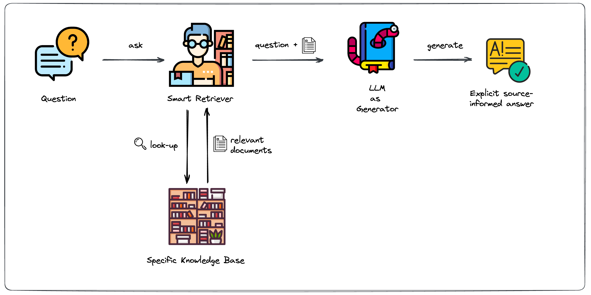
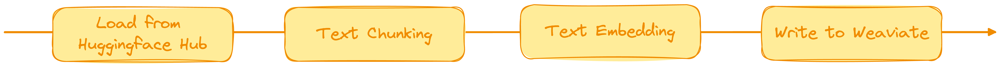

# Retrival Augmented Generation Ingestion Pipeline

<p align="center">
    <a href="https://github.com/ml6team/fondant">
        
    </a>
</p>
<p align="center">
</p>

## Introduction

Retrieval Augmented Generation (RAG) harnesses the capabilities of large language models (LLM),
combining
information retrieval with text generation. While LLMs are excellent at generating
grammatically correct text, they can sometimes produce inaccurate information, also known as
hallucination. RAG systems address this issue by retrieving data from databases, incorporating the
retrieved information, and instructing the model to answer questions using only the provided data.
This approach enables LLMs to deliver reliable and current responses without requiring
retraining, making them adaptable to evolving facts.

<p align="center">
    
</p>
<p align="center">
    RAG System Architecture
</p>

More information on RAG system you can find on the following
[blog post](https://blog.ml6.eu/leveraging-llms-on-your-domain-specific-knowledge-base-4441c8837b47)

An essential building block of the RAG system is the smart retriever. To build a custom RAG system
we have to make custom data searchable. Typically, semantic search is employed for this task.
Documents are transformed into embeddings, which are subsequently stored in a vector database.

## Pipeline Overview

The image below shows the entire pipeline and its workflow.
Note, for demo purpose we are using a dataset which is available on Huggingface. If you want to use
your own data, you have to adapt the initial LoadComponent. You could also customise the final
writing component.
If you want to store the embeddings in a different database, you have to implement your own
WriteComponent.


<p align="center">
    
</p>
<p align="center">
    Pipeline Overview
</p>


There are 4 components in total, these are:

- [Load from Huggingface Hub](https://github.com/ml6team/fondant/tree/main/components/load_from_hf_hub):
  The pipeline begins by loading text data from a Parquet file, which serves as the
  source for subsequent processing. For the minimal example we are using a dataset from Huggingface.
- [Text Chunking](https://github.com/ml6team/fondant/tree/main/components/chunk_text): Text data is
  chunked into manageable sections to prepare it for embedding. This
  step
  is crucial for performant RAG systems.
- [Text Embedding](https://github.com/ml6team/fondant/tree/main/components/embed_text): We are using
  a small HuggingFace model for the generation of text embeddings.
  The `embed_text` component easily allows the usage of different models as well.
- [Write to Weaviate](https://github.com/ml6team/fondant/tree/main/components/index_weaviate): The
  final step of the pipeline involves writing the embedded text data to
  a Weaviate database.

## Getting started

> ⚠️ **Prerequisites:**
>
> - A Python version between 3.8 and 3.10 installed on your system.
> - Docker installed and configured on your system.
> - A GPU is recommended to run the model-based components of the pipeline.

### Cloning the repository

Clone this repository to your local machine using one of the following commands:

**HTTPS**
```shell
git clone https://github.com/ml6team/fondant-usecase-rag.git
```

**SSH**
```shell
git clone git@github.com:ml6team/fondant-usecase-rag.git
```

### Installing the requirements

```shell
pip install -r requirements.txt
```

Confirm that Fondant has been installed correctly on your system by executing the following command:

```shell
fondant --help
```

### Running the pipeline

There are two options to run the pipeline:

- [Via python files and the Fondant CLI](./src/README.md): how you should run Fondant in production
- [Via a Jupyter notebook](./src/pipeline.ipynb): ideal to learn about Fondant
